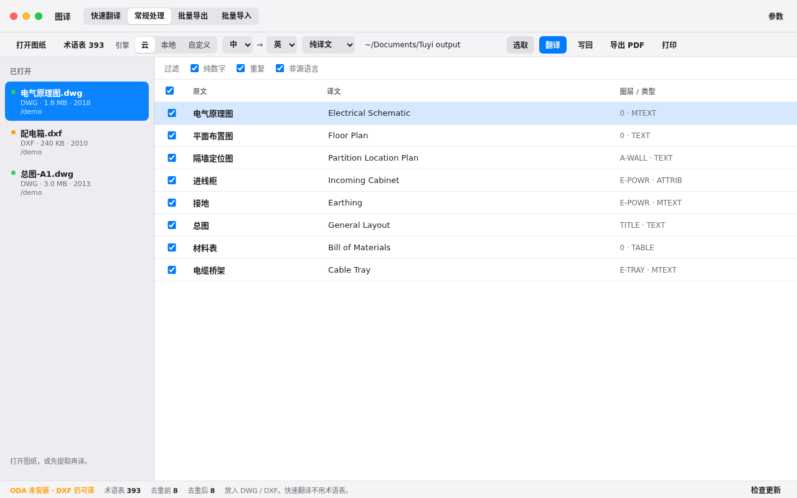
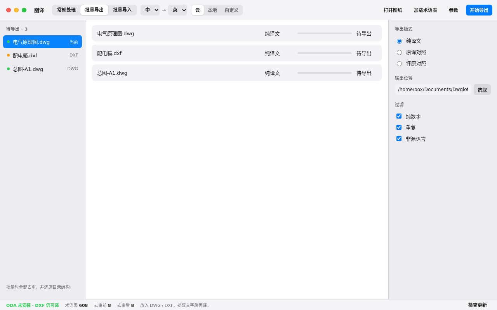
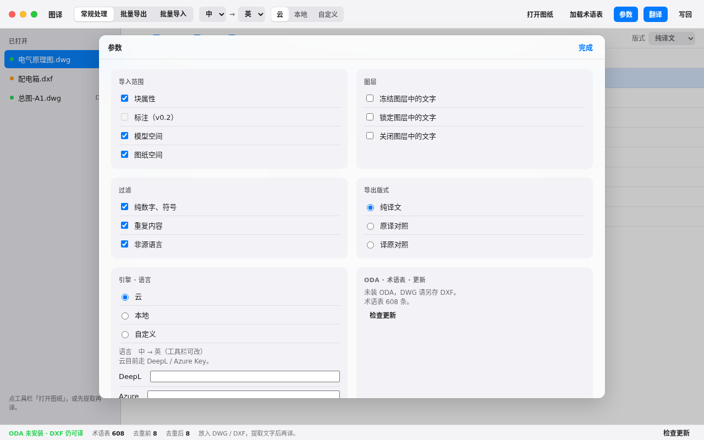

<h4 align="right"><strong><a href="README.md">English</a></strong> | 简体中文</h4>

<p align="center">
  
  <h1 align="center">图译 Dwglot</h1>
  <div align="center">
    <a href="https://github.com/erict16/dwglot/releases"></a>
    
    
    
  </div>
  <div align="center">图译是开源桌面 CAD translator。打开 DWG 或 DXF，把图纸里的文字译出来。用来做图纸翻译 / drawing translation，不需要 AutoCAD。</div>
</p>

<p align="center">
  
</p>
<p align="center">
  
  
</p>

## 特点

- **术语表：** 表里能对上的词直接用，不拿去机翻。剩下的可以用 Azure 或 DeepL，也可以用本机的 Ollama，或你自己的 OpenAI 兼容接口。
- **原文和译文：** 打开 DWG / DXF，对照着改原文和译文，再批量导出、写回图纸。v0.1 能处理 TEXT、MTEXT 和块属性。
- **密钥：** 没有遥测，也没有付费授权。API 密钥只存在你这台电脑上。
- **ODA：** 安装包里没有 ODA File Converter。DXF 可以直接译；译 DWG 要你自己装一份。

## 安装

v0.1 还没签名。Windows 安装包在 [GitHub Releases](https://github.com/erict16/dwglot/releases)。macOS Apple Silicon 的 DMG 跟版本 tag 一起由 CI 打（Intel 以后再说）。应用里的「检查更新」也看同一处。以后会用 Sparkle / WinSparkle，现在会直接打开新安装包。

**Mac 第一次打开（Gatekeeper）：** 右键图标，选「打开」。或到 系统设置 → 隐私与安全性 → 仍要打开。以后有开发者证书就不会再拦。

**Windows 第一次打开（SmartScreen）：** 「更多信息」→「仍要运行」。以后 Authenticode 签名就不会再拦。

不要用 UPX 打包。只译 DXF 不用装 ODA。译 DWG 请自己安装 [ODA File Converter](https://www.opendesign.com/guestfiles/oda_file_converter)，或设 `CAD_ODA_EXEC`。图译不会把 ODA 打进安装包。

从源码跑：

```bash
python3 -m venv .venv && source .venv/bin/activate
pip install -r requirements.txt
cd frontend && npm ci && npm run build && cd ..
python run.py
```

默认中译英。输出在 `~/Documents/Dwglot output`（访达里是「文稿/Dwglot output」）。

## 说明

- 从 [etianwang/CAD_translator](https://github.com/etianwang/CAD_translator) fork 过来（MIT）。图译换了名字和 Mac 界面，加上四种翻译引擎和自动更新。
- 标注和表格写回已经进 v0.1。这版 DIMENSION / ACAD_TABLE 可以写回去了。
- 落地页在 `landing/`，可以挂 Vercel。

## 协议

MIT。Copyright Eric Tan / Honsen CAD_translator 贡献者。
